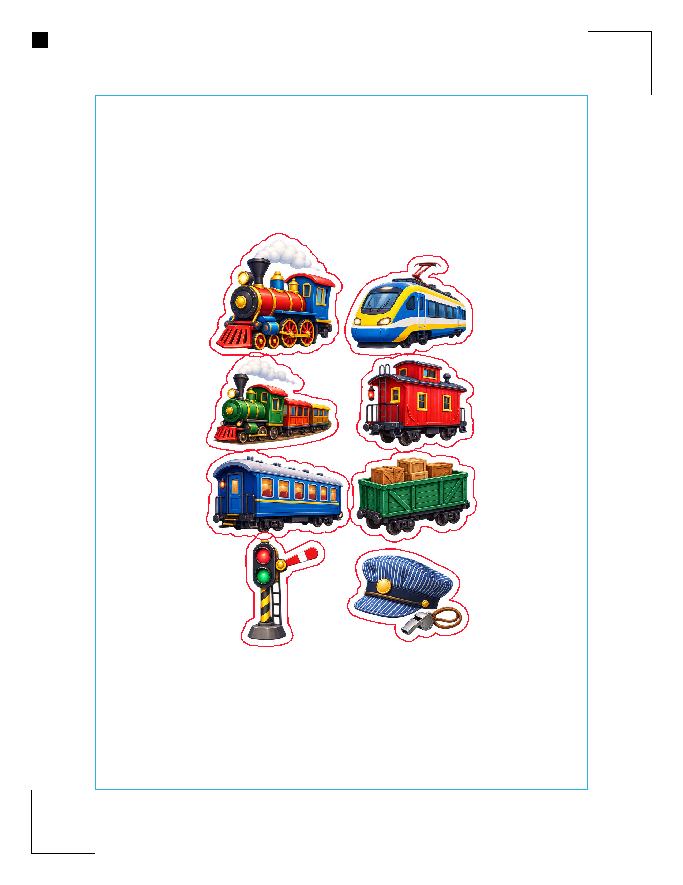

# sticker-cutter

`sticker-cutter` is a small command-line workflow for validating the software side of raster sticker Print & Cut before buying a Silhouette cutter. It detects disconnected stickers from a PNG, derives smooth physical cut contours, adds a configurable border, and writes mutually aligned print, cut, preview, and diagnostic artifacts.

The canonical coordinate system is millimeters. Pixels are used only for source-mask analysis and output rendering. The same page-space geometry drives the embedded SVG artwork, cut paths, print raster, preview, registration marks, and metadata.



The example above starts with an AI-generated transparent raster sheet, detects eight separate stickers, adds a 2 mm physical border, and places the artwork and contours inside a Letter-page Silhouette registration-safe region.

## Install

Python 3.10 or newer is required. With [uv](https://docs.astral.sh/uv/):

```bash
uv sync --extra dev
```

To run `inkscape-silhouette` from the project environment as well, install the optional driver dependencies:

```bash
uv sync --extra dev --extra silhouette
```

`inkex` uses native Cairo/GObject libraries, and the upstream driver uses native libusb. On macOS, installing Inkscape and `brew install libusb` is the simplest route; a source-built Python environment may additionally need `pkgconf`, `cairo`, and `gobject-introspection`. If those are already provided by Inkscape, point `--python` at that working extension interpreter instead of duplicating them.

The upstream `sendto_silhouette.py` must still come from an installed or checked-out copy of [fablabnbg/inkscape-silhouette](https://github.com/fablabnbg/inkscape-silhouette).

## Prepare a sheet

Transparent PNG input is recommended. Its alpha channel is deterministic and avoids guessing the background. Source DPI metadata defines the physical size; without reliable metadata the CLI assumes 300 DPI and records a warning. Override that explicitly when needed.

```bash
uv run sticker-cut prepare stickers.png --border 2mm --page letter
```

Useful controls include:

```bash
uv run sticker-cut prepare stickers.png \
  --output output \
  --input-dpi 300 \
  --dpi 300 \
  --min-area 1.0 \
  --closing 0.3mm \
  --simplify 0.12mm
```

The command creates:

```text
output/
  print-sheet.png
  cut-sheet.svg
  preview.png
  metadata.json
  verify-report.json
  dry-run/
    status.json
```

- `print-sheet.png` is a page-sized 300 DPI image containing artwork and registration marks, with no cut-line overlay. Print at **100% / Actual Size** and disable printer scaling.
- `cut-sheet.svg` uses physical `mm` dimensions and an equal-valued `viewBox`. It contains `Print`, `Regmarks`, and `Cut` Inkscape layers. Its original raster artwork is embedded, so the file is portable.
- `preview.png` overlays red blade contours and a cyan conservative safe-area rectangle for visual review. Do not print it.
- `metadata.json` records coordinate matrices, component statistics, full contour coordinates, registration positions, warnings, and artifact hashes.

The implementation uses the current upstream standard three-point mark convention: a 5 mm top-left square, 20 mm L-shaped top-right and bottom-left marks, and 0.3 mm strokes. The required IDs are `regmark-tl`, `regmark-tr`, and `regmark-bl`. `inkscape-silhouette` derives registration offsets from these elements and skips layers whose labels contain `Print` or `Regmarks`.

The layout is intentionally conservative: all cut contours must fit in the rectangle inset by the full 20 mm registration arms. Preparation fails instead of silently resizing physical artwork or allowing a cut through a mark-exclusion area.

## Verify

```bash
uv run sticker-cut verify output/
```

Verification checks page pixels and DPI, SVG page units/viewBox, expected layers and registration IDs, cut count, closed contours, metadata bounding boxes, safe-area containment, coordinate scales, and artifact hashes. It writes `verify-report.json` and exits nonzero on disagreement.

## Exercise inkscape-silhouette without a cutter

```bash
uv run sticker-cut silhouette-dry-run output/cut-sheet.svg \
  --driver /path/to/inkscape-silhouette/sendto_silhouette.py
```

The wrapper performs two upstream dry runs. Current `inkscape-silhouette` still waits for a real optical-sensor response whenever registration is enabled, even with `--dry_run=True`. The first probe enables registration and search, confirms that the document marks are detected, captures the generated registration command, and treats the driver's specific no-sensor stop as expected. The second pass exercises complete blade-command generation with registration disabled but applies the exact same negative registration-origin offset that upstream applies after a successful scan. This covers the full hardware-free path without pretending that an optical scan occurred.

It captures:

```text
output/dry-run/
  status.json
  silhouette.log
  cutter-commands.bin
  registration-probe.log
  registration-commands.bin
  stdout.txt
  stderr.txt
```

The run passes only when the complete blade pass exits successfully, logs parsed cut paths, writes cutter commands, reaches ready status, and the registration probe detects the document marks and reaches either a real success or the expected no-hardware sensor stop. A cutter is neither required nor contacted. Use `--python` if the driver needs a different Python environment, or set `INKSCAPE_SILHOUETTE_DRIVER` instead of passing `--driver` every time.

## Opaque images

Fully opaque images fall back to foreground estimation based on color distance from the median border color. This is deliberately simple and reported in metadata. For reproducible contour extraction, remove the background first and use a transparent PNG.

## Tests

```bash
uv run pytest
```

The synthetic tests cover a known 40 mm object, a 2 mm border, multiple shapes, noise rejection, page safety, output/coordinate agreement, registration SVG conventions, and dry-run capture.

`examples/synthetic-stickers.png` is a deterministic visual fixture containing a circle, rounded rectangle, concave star, irregular polygon, and a one-pixel noise artifact. Regenerate it with `uv run python examples/generate_fixture.py`.

The `examples/train-stickers/` directory contains the generated train source sheet and its complete verified output set.
